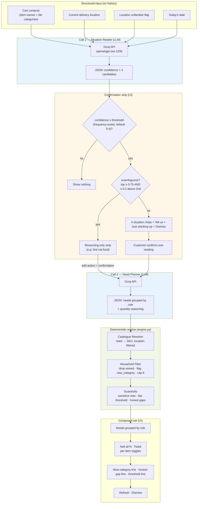
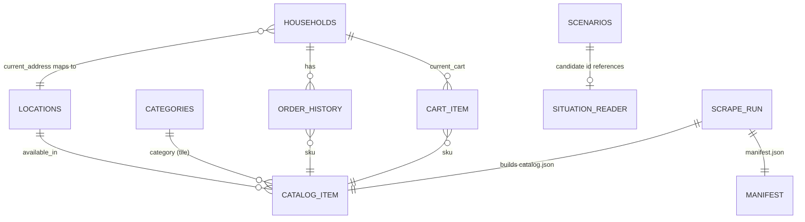

# System Architecture: Blinkit Sense

**Working name:** Blinkit Sense  
**Architecture type:** API-wrapper — structured input → LLM reasoning → structured output → deterministic guardrails.

> **This is not a RAG system.** There is no vector database, no embeddings, no chunking, and no document retrieval. The LLM receives structured cart and context data and returns structured JSON. All product grounding happens in deterministic code against a committed `catalog.json`.

---

## 1. Design principles

| Principle | Implication for architecture |
|---|---|
| **History is an output filter, not a detection input** | The situation reader receives cart contents and delivery location only — never purchase history. Household history is consulted only after the customer confirms a situation, in the household filter layer. |
| **Cold start must not exist** | First-order and five-year customers receive identical inference quality. No CF, no embeddings, no “light user” suppression. The LLM path is the same for everyone. |
| **Needs, not SKUs, from the LLM** | Call 2 returns abstract needs (`"bedsheet"`, `"bucket and mug"`). The catalogue resolver maps needs to real SKUs. Hallucinated product names are structurally impossible. |
| **Deterministic where correctness matters** | SKU resolution, tie-breaking, location filtering, category flags, caps, sensitive-category veto, and fee maths are pure Python — no LLM involvement. Same input always produces the same output. |
| **Fail closed on uncertainty** | Malformed LLM JSON, sub-threshold confidence, or unresolvable partial sets → show nothing. Never render guessed or half-parsed output. |
| **Metric-validity by tile category** | `new_category` is flagged when the item’s **tile** has zero purchase history for the household. Same-group deepening (e.g. cat litter when they already buy cat food from Pet Store) counts as `deepening`, not new-category expansion. |
| **Stored catalogue, not live fetch** | The app reads committed `data/catalog.json` at interaction time. Freshness is proved by scheduled scrapes, versioned raw run folders, and commit history — not by per-click API calls. |
| **Non-blocking, once-per-session confirmation** | Situation chips render in a cart strip — never a modal. Fires once per session. Dismissals and “just stocking up” are recorded as signal, not errors. |
| **Reasoned requirement set, not a product grid** | Output is grouped by role with quantity reasoning. Tiles-with-prices alone would be indistinguishable from “People also bought” and would fail the product thesis. |
| **Asymmetric cost of silence** | Confidence threshold (default 0.4) is tuned down as `orders_per_month` drops — a once-a-month customer’s single order is the only touchpoint. |
| **Honest gaps over padding** | Unmatched needs and catalogue holes are surfaced explicitly. Popular-SKU padding when the situation isn’t coverable is forbidden. |
| **Phased, independently testable build** | Each build phase lives in its own folder under `phases/` with config, code, and README. Phases gate on runnable tests before the next begins. |

---

## 2. End-to-end flow

### 2.1 Mermaid diagram



### 2.2 Sequence summary

1. **Load household** — cart SKUs resolved to names and tile categories from `catalog.json`; current location checked against `known_addresses`.
2. **Situation reader** — single LLM call with cold cart signal. Returns confidence and four candidate situations.
3. **Gate** — if confidence below frequency-tuned threshold, end. No strip.
4. **Confirmation** — if **unambiguous** (top candidate ≥ 0.75 and ≥ 0.2 above second): reasoning-only strip; add-action confirms. Otherwise: four chips + free text + escape hatches. See §4.1.
5. **Need planner** — second LLM call with confirmed situation + tile category list. Returns role-grouped needs.
6. **Catalogue resolver** — each need matched to one SKU in `catalog.json`, filtered by `available_in` for current location. Unmatched → honest gap.
7. **Household filter** — drop SKUs already in routine basket; flag each item `new_category` or `deepening` by tile; apply sensitive-category veto; cap at 6; compute fee-threshold gap.
8. **Render** — role-grouped composed set with add-all, refresh, dismiss.

---

## 3. Data model

All static data lives under `data/`. The app never fetches Blinkit at interaction time.

### 3.1 Entity relationship (logical)



### 3.2 `data/categories.json`

Blinkit’s real taxonomy: **four groups, 28 tiles**, plus **12 dedicated Stores** (Pet Store, Spiritual Needs, etc.).

| Field | Type | Description |
|---|---|---|
| `groups[].name` | string | e.g. `"Grocery & Kitchen"` |
| `groups[].tiles[]` | string[] | Tile names within the group |
| `stores[]` | string[] | Standalone store tiles outside the four groups |

**Rule:** A category is a **tile**, not a group. `new_category` flags are evaluated at tile granularity (e.g. cat food in Pet Store vs. floor cleaner in Cleaners & Repellents are different tiles).

### 3.3 `data/locations.json`

| Location | Coordinates | Demo role |
|---|---|---|
| Sarjapur, Bangalore | 12.8575579, 77.7864057 | Home base for h1, h3, h4 |
| Whitefield, Bangalore | (scraped) | h2 within-city move |
| Delhi NCR | (scraped) | h5 cross-city move; deepest assortment |

Each location defines the coordinate pair passed to the scraper and the string used in `available_in` on catalog items.

### 3.4 `data/catalog.json`

Array of 250–400 products. Built from the most recent successful scrape (or generated fallback).

```json
{
  "id": "sku_014",
  "name": "Clumping cat litter 5kg",
  "brand": "BearHugs",
  "category": "Pet Store",
  "price": 449,
  "mrp": 499,
  "unit": "5 kg",
  "available_in": ["Sarjapur", "Whitefield", "Delhi NCR"],
  "fetched_at": "2026-07-31T06:18:58Z"
}
```

| Field | Constraint |
|---|---|
| `category` | Must be a tile from `categories.json` |
| `available_in` | Subset of location names; resolver checks against household’s current location |
| `fetched_at` | ISO 8601 UTC; propagated from scrape run timestamp |

### 3.5 `data/households.json`

Five demo profiles driving end-to-end flows.

```json
{
  "id": "h1",
  "name": "Sarjapur household",
  "known_addresses": ["Sarjapur, Bangalore"],
  "current_address": "Sarjapur, Bangalore",
  "orders_per_month": 12,
  "order_history": [{ "sku": "sku_001", "orders_per_month": 8 }],
  "current_cart": ["sku_022", "sku_005"]
}
```

| Field | Purpose |
|---|---|
| `known_addresses` | Addresses the household has ordered to before |
| `current_address` | Active delivery location; unfamiliar if not in `known_addresses` |
| `orders_per_month` | Drives frequency-tuned confidence threshold |
| `order_history` | Used **only after confirmation** — tile-level purchase frequency |
| `current_cart` | SKU IDs loaded into the cart for demo |

**Unfamiliar-location signal:** `current_address ∉ known_addresses` → passed to situation reader as a confidence raiser.

**Demo household profiles:**

| ID | Cart signal | `orders_per_month` | Notes |
|---|---|---|---|
| h1 | Dry fruits + routine groceries | 12 | Ambiguous cart (hero demo) |
| h2 | Move basket; unfamiliar Whitefield | 8 | Within-city move; threshold lowered to 0.36 |
| h3 | First-ever cat food | 2 | No-history demo; threshold lowered to 0.25 |
| h4 | Milk, bread, eggs only | **12** | Low-signal demo — must show nothing |
| h5 | Cross-city to Delhi NCR | 6 | Exploratory; not a required demo flow |

**h4 is a frequent orderer (12 orders/month)** so its confidence threshold stays at the base **0.4** — not lowered. This makes demo 6 stronger: even for our most frequent customer, a staples-only cart correctly gets silence. If h4 were infrequent, the frequency-tuned formula would drop its threshold to 0.25 and a staples cart scoring 0.3 would incorrectly fire the strip.

### 3.6 `data/scenarios.json`

Situations as data so new demo scenarios need no code changes.

```json
{
  "id": "moving_in",
  "chip_label": "Moving in",
  "prompt_context": "The customer has just moved into a new, empty home."
}
```

| Field | Used by |
|---|---|
| `id` | Situation reader candidate IDs; need planner context lookup |
| `chip_label` | UI chip text (≤ 4 words) |
| `prompt_context` | Injected into need planner system/user prompt |

### 3.7 `data/raw/<UTC timestamp>/` — versioned scrape runs

Each scrape creates a self-contained run folder:

```
data/raw/
  20260731T061858/
    manifest.json
    sarjapur.json               # combined raw responses for all 30 keywords at this location
    whitefield.json
    delhi_ncr.json
```

One combined JSON file per location (3 files per run), not one file per keyword per location — 90 files committed weekly would bloat the repo for no evaluative benefit. Each location file is a map of keyword → raw API response; the manifest records counts and failures per keyword.

**`manifest.json` schema:**

```json
{
  "run_id": "20260731T061858",
  "started_at": "2026-07-31T06:18:58Z",
  "completed_at": "2026-07-31T06:42:11Z",
  "keywords": ["cat food", "bed sheet", "..."],
  "locations": ["Sarjapur", "Whitefield", "Delhi NCR"],
  "counts_per_keyword": {
    "Sarjapur": { "cat food": 12, "bed sheet": 8 },
    "Whitefield": { "cat food": 10, "bed sheet": 7 },
    "Delhi NCR": { "cat food": 15, "bed sheet": 11 }
  },
  "failures": [
    { "keyword": "diya", "location": "Sarjapur", "error": "HTTP 429" }
  ],
  "source": "live_scrape",
  "user_agent": "BlinkitSenseCatalogueBot/1.0 (+https://github.com/...)"
}
```

After a successful run, the build step merges deduplicated products into `data/catalog.json`. Two adjacent run folders plus differing `manifest.json` counts are the liveness proof for evaluators.

---

## 4. The two LLM calls

Both calls live in `llm.py`. Provider, API key, and model are read from `.env`. Both use Groq’s OpenAI-compatible client.

```
GROQ_API_KEY=...
GROQ_MODEL=openai/gpt-oss-120b
GROQ_MODEL_ALT=llama-3.3-70b-versatile
```

### 4.1 Call 1 — Situation Reader

**Purpose:** Read the cart cold and propose up to four plausible situations.

**Input (constructed by app, sent as user message JSON):**

```json
{
  "cart_items": [
    { "name": "Premium kaju 500g", "category": "Dry Fruits & Cereals" },
    { "name": "Amul Taaza Milk 1L", "category": "Dairy, Bread & Eggs" }
  ],
  "delivery_location": "Sarjapur, Bangalore",
  "location_unfamiliar": false,
  "today": "2026-07-31"
}
```

**Output contract (LLM must return JSON only — no markdown fences, no prose):**

```json
{
  "confidence": 0.82,
  "candidates": [
    {
      "id": "festival_gifting",
      "label": "Festival gifting",
      "reasoning": "dry fruits in festival week",
      "score": 0.82
    },
    {
      "id": "hosting",
      "label": "Guests coming",
      "reasoning": "dry fruits often served to visitors",
      "score": 0.45
    },
    {
      "id": "health",
      "label": "Eating better",
      "reasoning": "dry fruits as a snack replacement",
      "score": 0.38
    },
    {
      "id": "stocking",
      "label": "Just stocking up",
      "reasoning": "no situational signal",
      "score": 0.15
    }
  ]
}
```

| Field | Constraint |
|---|---|
| `confidence` | Float 0.0–1.0; must equal `candidates[0].score` |
| `candidates` | Exactly 4 entries, ordered by descending `score` |
| `candidates[].id` | Should align with `scenarios.json` IDs where possible |
| `candidates[].label` | ≤ 4 words; customer-facing chip text |
| `candidates[].reasoning` | One short clause; shown in unambiguous mode |
| `candidates[].score` | Float 0.0–1.0; per-candidate likelihood |

**System prompt design (outline):**

- Role: checkout-time situation inference for an Indian quick-commerce app.
- Input description: cart item names with tile categories, delivery location, unfamiliar flag, date.
- Output: JSON matching the schema above. No other text.
- Each candidate must include a `score` (0.0–1.0, descending); `confidence` equals the top candidate's score.
- Calibration instructions: high confidence for strong situational items (cat food, bedsheet, dry fruits near festivals); low confidence (< 0.4) for staple-only carts (milk, bread, eggs).
- Unfamiliar location and festival proximity raise confidence.
- Never reference purchase history — it is not provided and must not be inferred.
- Candidate labels must be ≤ 4 words.

**Defensive parsing:**

1. Strip leading/trailing whitespace.
2. If response starts with ` ``` `, attempt to extract JSON from fenced block; if extraction fails → fail closed.
3. `json.loads()` with explicit schema validation (required keys, types, array length 4).
4. Clamp `confidence` and each `candidates[].score` to [0.0, 1.0]; verify `confidence == candidates[0].score`.
5. Reject candidates with labels > 4 words (truncate or fail — prefer fail closed for demo integrity).

**Fail-closed behaviour:**

| Failure | Result |
|---|---|
| API error, timeout | No strip; log error |
| Non-JSON response | No strip |
| Missing required fields | No strip |
| `confidence` below threshold | No strip (not an error — expected for h4) |
| Partial candidate array | No strip |

**Frequency-tuned threshold:**

```python
base_threshold = 0.4
# Lower threshold as orders_per_month decreases
adjusted = base_threshold - max(0, (12 - orders_per_month)) * 0.02
# Floor at 0.25 for very infrequent customers
threshold = max(0.25, adjusted)
```

At 12+ orders/month the threshold stays at 0.4 (h1, h4). h4 relies on this — see §3.5.

**Unambiguous vs ambiguous (confirmation mode):**

After passing the confidence threshold, the app decides whether to show chips or a reasoning-only strip. A reading is **unambiguous** when **both** conditions hold:

1. The top candidate's `score` is **≥ 0.75**
2. The top candidate's `score` is **≥ 0.2 higher** than the second candidate's `score`

**Calibration note:** The 0.2 gap was tuned against observed score gaps across the five demo carts (0.06, 0.14, 0.23, 0.05, 0.05). A 0.3 gap was too strict — h3's cat-food reading (gap 0.23) would incorrectly require chips. At 0.2, the single-dominant-reading case (h3) routes to the reasoning-only strip while genuinely ambiguous carts (h1 gap 0.14, h4/h5 gap 0.05–0.06) still show chips.

Otherwise show chips. Example: h3 (first cat food) might return scores `[0.88, 0.42, 0.30, 0.12]` → unambiguous (0.88 ≥ 0.75 and 0.88 − 0.42 = 0.46 ≥ 0.2). h1 (dry fruits + groceries) might return `[0.82, 0.68, 0.45, 0.15]` → ambiguous (0.82 − 0.68 = 0.14 < 0.2) → show chips.

```python
def is_unambiguous(response: dict) -> bool:
    top = response["candidates"][0]["score"]
    second = response["candidates"][1]["score"]
    return top >= 0.75 and (top - second) >= 0.2
```

Referenced in the end-to-end flow (§2.1): after the confidence gate passes, the `UNAMB` decision node routes to the reasoning-only strip or to chips.

### 4.2 Call 2 — Need Planner

**Purpose:** Decompose a confirmed situation into abstract needs grouped by role.

**Input:**

```json
{
  "situation_id": "moving_in",
  "situation_label": "Moving in",
  "prompt_context": "The customer has just moved into a new, empty home.",
  "tile_categories": ["Vegetables & Fruits", "Pet Store", "..."]
}
```

`tile_categories` is the full list from `categories.json` so the planner knows what domains exist — not to retrieve products.

**Output contract:**

```json
{
  "situation_label": "Setting up a new home",
  "needs": [
    {
      "role": "Sleep",
      "need": "bedsheet",
      "why": "nothing to sleep on yet",
      "quantity_reasoning": "one double bed"
    },
    {
      "role": "Bathroom",
      "need": "bucket and mug",
      "why": "no bathroom basics in an empty flat",
      "quantity_reasoning": "one set"
    }
  ],
  "unavailable": []
}
```

| Field | Constraint |
|---|---|
| `needs[].need` | Abstract item description — **never** a brand or SKU name |
| `needs[].role` | Grouping label for UI (Sleep, Bathroom, Cleaning, etc.) |
| `needs[].why` | One sentence of situational reasoning |
| `needs[].quantity_reasoning` | Human-readable quantity logic |
| `unavailable` | Needs the planner knows Blinkit cannot cover (optional advisory) |

**System prompt design (outline):**

- Role: decompose a confirmed life situation into a requirement set for an Indian household.
- Use world knowledge: moving in → bucket, mop, dustbin, not just bedsheet; Diwali → diyas, wicks, oil; new cat → litter, tray, bowl (not phenyl).
- Return needs as generic nouns, never brand names or specific SKUs.
- Do not suggest Health & Pharma or Baby Care products for auto-composition — note them in `unavailable` or omit (code veto is the backstop).
- Output JSON only, matching schema.

**Defensive parsing:** Same pipeline as Call 1 — strip fences, validate schema, reject on malformed output.

**Fail-closed behaviour:** Any parse failure → no composed set; customer sees error state or empty result, never a partial need list with guessed SKUs.

---

## 5. Scraper and scheduled refresh

### 5.1 Scraper (`phases/phase_1_scraper/`)

Blinkit publishes no public developer API. The storefront loads product JSON from internal endpoints discovered by inspecting network traffic. `scraper.py`:

1. Accepts 30 keywords × 3 locations (see problem statement section 4).
2. Calls Blinkit’s internal product-search endpoint with location coordinates from `locations.json`.
3. Rate-limits: **2-second delay** between requests.
4. Sends an **identifying User-Agent** (recorded in manifest).
5. Writes raw responses to `data/raw/<UTC timestamp>/` — one combined JSON file per location (see §3.7), not one file per keyword.
6. Writes `manifest.json` with keyword/location counts and failures.
7. Builds deduplicated `data/catalog.json` from the run.

**Fallback:** If scrape fails or is blocked, generate a representative catalogue with realistic Indian product names and prices; set `manifest.source = "generated_fallback"`; document in README.

**Assortment-depth evidence:** `counts_per_keyword` in manifest must show Delhi NCR ≥ Sarjapur for most keywords — first-party proof of assortment-depth claim.

### 5.2 In-app refresh

Sidebar **“Refresh catalogue”** button invokes the same scraper code path as CI. Behaviour is identical; only the trigger differs.

### 5.3 GitHub Actions — `.github/workflows/refresh-catalogue.yml`

```yaml
name: Refresh catalogue

on:
  schedule:
    - cron: "45 3 * * 1"   # 09:15 IST every Monday (Actions cron is UTC)
  workflow_dispatch: {}     # manual trigger in Actions tab

permissions:
  contents: write            # required for git push (default token is read-only)

jobs:
  refresh:
    runs-on: ubuntu-latest
    steps:
      - uses: actions/checkout@v4
      - uses: actions/setup-python@v5
        with:
          python-version: "3.11"
      - run: pip install -r requirements.txt
      - run: python -m phases.phase_1_scraper.scraper
      - name: Commit updated catalogue
        run: |
          git config user.name "github-actions[bot]"
          git config user.email "github-actions[bot]@users.noreply.github.com"
          git add data/catalog.json data/raw/
          git diff --staged --quiet || git commit -m "chore: refresh catalogue [skip ci]"
          git push
```

**Liveness proof for evaluators:** commit history + diffs between run folders + manual `workflow_dispatch` producing a second timestamped folder.

**Failure handling:** If the workflow scrape fails, the previous committed `catalog.json` remains served. The workflow surfaces the error in Actions logs; the app never silently presents stale data as freshly fetched.

---

## 6. Deterministic layers (`engine.py`)

All logic below is pure Python — testable without an LLM.

### 6.1 Catalogue resolver

**Input:** List of needs from Call 2; household’s current location; `catalog.json`.

**Algorithm (per need):**

1. Tokenize `need` string into lowercase words (split on spaces; strip punctuation).
2. **Strip stopwords** before scoring: `and`, `or`, `the`, `a`, `for`, `with`. Without this, `"bucket and mug"` would match products on `"and"` alone.
3. Filter catalog to items where `current_location ∈ available_in`.
4. Score each candidate: count of remaining need words appearing in product `name` (case-insensitive substring match).
5. **Tie-break:** highest word overlap → then **lowest price**.
6. Select exactly **one SKU per need**. Never two bedsheets.
7. **SKU deduplication:** track resolved SKU IDs across needs. If a second need resolves to an already-used SKU, keep the first match and mark the second need as a gap (same product cannot satisfy two distinct needs).
8. If no candidate scores > 0, emit an **honest gap** entry (need text preserved, no SKU).

**Output per need:**

```json
{
  "role": "Sleep",
  "need": "bedsheet",
  "resolved_sku": "sku_042",
  "resolved_name": "Cotton double bedsheet",
  "price": 599,
  "category": "Home & Lifestyle",
  "status": "matched"
}
```

Or for unmatched:

```json
{
  "role": "Cleaning",
  "need": "vacuum cleaner",
  "status": "gap",
  "gap_message": "We don't stock this — you'll need it elsewhere."
}
```

### 6.2 Household filter

Runs **after** resolver, **after** customer confirmation. Has access to `order_history`.

| Step | Rule |
|---|---|
| Drop owned | Remove SKUs where `orders_per_month` ≥ threshold (routine basket) |
| Flag category | For each remaining item, look up its tile. If tile has zero history → `new_category: true`; else → `deepening: true` |
| Sensitive veto | Remove auto-composed items in **Health & Pharma** and **Baby Care**. Replace with category-level guidance string only. |
| Cap | Keep at most **6** items. Prioritize `new_category` items for demo ordering. |
| Cart dedup | Drop items already in `current_cart` |

### 6.3 New-category flagging

```python
catalog_by_id = {item["id"]: item for item in catalog}

purchased_tiles = {
    catalog_by_id[entry["sku"]]["category"]
    for entry in household["order_history"]
    if entry["sku"] in catalog_by_id
}

for item in composed_set:
    tile = item["category"]
    item["flag"] = "new_category" if tile not in purchased_tiles else "deepening"
```

Cross-boundary example: cat food (Pet Store) in history does **not** prevent `new_category` on pet-safe floor cleaner (Cleaners & Repellents).

### 6.4 Fee threshold maths

From live Blinkit fee model:

| Component | Amount |
|---|---|
| Delivery | ₹30 |
| Handling | ₹12 |
| Small-cart surcharge | ₹20 (waived when cart ≥ ₹99) |

```python
FEE_DELIVERY = 30
FEE_HANDLING = 12
FEE_SMALL_CART = 20
THRESHOLD = 99

def fee_breakdown(cart_subtotal: int) -> dict:
    small_cart = FEE_SMALL_CART if cart_subtotal < THRESHOLD else 0
    total_fees = FEE_DELIVERY + FEE_HANDLING + small_cart
    gap_to_threshold = max(0, THRESHOLD - cart_subtotal)
    return {
        "delivery": FEE_DELIVERY,
        "handling": FEE_HANDLING,
        "small_cart": small_cart,
        "total_fees": total_fees,
        "gap_to_threshold": gap_to_threshold,
    }
```

**Threshold-aware sizing:** When composing the set, if `cart_subtotal + suggested_total < THRESHOLD`, the UI shows how much more clears the small-cart charge. Sizing targets clearing the threshold, not maximizing basket value.

---

## 7. Guardrails

| Guardrail | Mechanism | Layer |
|---|---|---|
| **Confidence threshold** | Default 0.4, frequency-tuned down for infrequent orderers. Below → no strip. | Post–Call 1 |
| **Sensitive-category veto** | Hard code gate: Health & Pharma, Baby Care never auto-composed. | Household filter |
| **Honest gaps** | Unmatched needs render gap message; no popular-SKU padding. | Resolver + UI |
| **Cap at 6** | Truncate composed set; prioritize `new_category`. | Household filter |
| **No action without confirmation** | Ambiguous readings require chip tap. Unambiguous → reasoning shown; add = confirm. | UI |
| **History not in detection** | Situation reader prompt and input exclude order history. | Call 1 |
| **No hallucinated products** | LLM returns needs only; resolver binds to catalog. | Call 2 + resolver |
| **Fail closed on bad JSON** | Defensive parse; any failure → show nothing. | Both LLM calls |
| **Location honesty** | SKU must be in `available_in` for current location or become a gap. | Resolver |
| **Metric validity** | Only `new_category` tiles count toward the product objective. | Household filter + demo validation |
| **Once per session** | `st.session_state` flag prevents re-firing strip. | UI |
| **Scrape failure** | Serve last committed catalog; surface error; never fake freshness. | Scraper + UI |
| **Rate limiting** | 2 s delay + identifying User-Agent on scraper. | Scraper |

---

## 8. Observability and evaluation

### 8.1 Runtime observability

| Signal | Where logged | Purpose |
|---|---|---|
| LLM latency (ms) | `llm.py` | Per-call timing for model comparison |
| Raw LLM response | Debug log (not user-facing) | Parse failure diagnosis |
| Confidence + candidates | Session state | Confirmation UX audit |
| Resolver match/gap counts | `engine.py` | Catalogue coverage |
| `new_category` vs `deepening` counts | `engine.py` | Metric-validity check per demo |
| Scrape manifest | `data/raw/*/manifest.json` | Catalogue liveness |
| Dismiss / “just stocking up” | Session analytics (local) | Bad-hypothesis signal |

### 8.2 Model comparison (`compare_models.py`)

Runs the same five test carts through both models and writes `docs/model_comparison.md`.

| Model | Provider | Env var |
|---|---|---|
| Primary | Groq | `GROQ_MODEL=openai/gpt-oss-120b` |
| Comparison | Groq | `GROQ_MODEL_ALT=llama-3.3-70b-versatile` |

**Test set:** All five household carts (h1–h5), with intended situation labels defined in test fixtures.

### 8.3 Evaluation dimensions

| Dimension | Definition | Measurement |
|---|---|---|
| **Situation-reading accuracy** | Does the top candidate (or unambiguous reading) match the intended situation for each demo cart? | % match across 5 carts × N runs. Report per-cart confusion. |
| **Confidence calibration** | Staples-only (h4) below 0.4; dry-fruits ambiguous (h1) above 0.6; cat-food (h3) high. | Threshold pass/fail per cart; plot confidence distribution. |
| **Need-planning completeness** | Does “Moving in” include bucket, mop, dustbin — not just bedsheet? Does Diwali include diyas, wicks, oil? | Checklist scoring against expected need tokens per scenario. |
| **World-knowledge depth** | Cat situation avoids phenyl; festival situation covers spiritual items. | Negative/positive token presence in need lists. |
| **Format compliance** | Valid JSON without markdown fences. | % valid parses over 10 runs per model per call. |
| **Misinterpretation rate** | Top situation candidate wrong ÷ total runs. | Primary comparison metric between the two models. |
| **Latency** | Wall-clock seconds per call. | Mean, p95 per model. |

### 8.4 Evaluation output format (`docs/model_comparison.md`)

```markdown
# Model Comparison

## Summary
| Dimension | gpt-oss-120b | llama-3.3-70b |
|---|---|---|
| Situation accuracy (top-1) | ... | ... |
| Misinterpretation rate | ... | ... |
| Format compliance | ... | ... |
| Mean latency Call 1 | ... | ... |
| Mean latency Call 2 | ... | ... |

## Per-cart breakdown
### h1 — Ambiguous (dry fruits + groceries)
...

## Need-planning completeness
### Moving in
Expected: bedsheet, pillow, towel, bucket, mug, mop, dustbin
...
```

---

## 9. Phase folder structure

Each phase is self-contained under `phases/` with `config.py`, implementation module(s), and `README.md`. Phases gate on tests before proceeding.

```
phases/
  phase_1_scraper/
    __init__.py
    config.py          # keywords, locations, rate limit, user-agent
    scraper.py         # fetch, raw write, manifest, catalog build
    README.md

  phase_2_data/
    __init__.py
    config.py
    loader.py          # load/validate categories, households, locations, scenarios
    README.md

  phase_3_situation_reader/
    __init__.py
    config.py
    reader.py          # Call 1 wrapper (imports shared llm.py when integrated)
    README.md

  phase_4_confirmation/
    __init__.py
    config.py
    strip.py           # chip rendering logic, session state contract
    README.md

  phase_5_need_planner/
    __init__.py
    config.py
    planner.py         # Call 2 wrapper
    README.md

  phase_6_resolver/
    __init__.py
    config.py
    resolver.py        # need → SKU, tie-break, location filter, gaps
    README.md

  phase_7_household_filter/
    __init__.py
    config.py
    filter.py          # owned drop, new_category flag, cap, sensitive veto, fee maths
    README.md
```

**Root integration modules (post-phase):**

| Module | Responsibility |
|---|---|
| `llm.py` | Both LLM calls, `.env` provider config, shared defensive parsing |
| `engine.py` | Orchestrates resolver + household filter + guardrails |
| `app.py` | Streamlit UI — wide layout, household selector, cart, strip, composed set |
| `compare_models.py` | Evaluation runner |
| `test_*.py` | Phase gate tests |

**Phase → test mapping:**

| Phase | Gate test |
|---|---|
| 1 Scraper | Manual: counts printed; `manifest.json` + `catalog.json` exist |
| 2 Data | `test_categories.py` — location unfamiliar, tile history, demo SKU flags |
| 3 Situation reader | `test_situation.py` — all five households |
| 4 Confirmation | Manual/UI: chips render, session persists |
| 5 Need planner | `test_needs.py` — Moving in, Festival gifting |
| 6 Resolver | Unit tests: tie-break, location gap, honest gap |
| 7 Household filter | `test_engine.py` — full chain for h2, all items labelled |

Phases 8–11 (output rendering, model comparison, scheduled refresh, polish/deploy) integrate root modules and do not require separate phase folders beyond what is listed — they compose prior phases.

---

## 10. Limitations

| Limitation | Architectural consequence | Maps to deliverable |
|---|---|---|
| **No purchase history in detection** | Cannot personalize situation inference; may propose irrelevant chips for eclectic carts. Customer resolves in one tap. | Demo 4 (incoherent cart); confirmation strip design |
| **Committed catalogue, not live** | SKUs may be stale between weekly refreshes. Honest gaps increase if products delisted. | Scheduled refresh workflow; sidebar timestamp |
| **Keyword-scraped assortment (250–400 SKUs)** | Many situational needs won’t resolve. System must surface gaps, not pad. | Demo 5 (honest gap) |
| **Location-specific availability** | Same need may resolve in Delhi but gap in Sarjapur. | h2 vs h5 exploration; resolver `available_in` check |
| **Single-turn, no conversation** | Customer cannot refine needs after confirmation except refresh/dismiss. | Out of scope (§13); refresh button |
| **Desktop Streamlit prototype** | Not in-app mobile surface. | UI spec §11; deck wireframe note |
| **Two sensitive categories hard-vetoed** | Health & Pharma and Baby Care show guidance only, never auto-add. | Guardrails table §6 |
| **Cap at 6 items** | Partial coverage by design for complex situations (e.g. full move-in). | Guardrails; role-grouped display |
| **LLM non-determinism** | Same cart may yield slightly different chips across runs. Resolver tie-break restores determinism post-confirmation. | Model comparison deliverable |
| **Scrape fragility** | Blinkit may block or change endpoints. Fallback catalogue + manifest failure recording. | Phase 1 README; generated fallback |
| **No lead-time reminders** | System only acts at checkout when the window has collapsed. | Design principle; out of scope §13 |
| **No semantic search** | Free text in strip is a chip input to the need planner, not a search bar. | Confirmation rules §3 |

### Deliverable traceability

| Problem statement deliverable | Architecture section |
|---|---|
| API-wrapper (not RAG) | §1 principles, §4 LLM calls |
| Two LLM calls with JSON contracts | §4 |
| Situation reader cold, history after confirm | §2 flow, §6.2 household filter |
| `catalog.json` from scraper | §3.4, §5 |
| Versioned raw run folders + manifest | §3.7, §5.1 |
| GitHub Actions cron + workflow_dispatch | §5.3 |
| Categories as tiles | §3.2, §6.3 |
| Five households + demo flows | §3.5, §8.2 |
| Guardrails (confidence, sensitive, gaps, cap) | §7 |
| Model comparison (`compare_models.py`) | §8 |
| Phased build under `phases/` | §9 |
| Fee threshold sizing | §6.4 |
| Streamlit UI spec | §2 (Confirm/Output nodes), root `app.py` in §9 |
| Metric: new category by tile | §6.3, §1 metric-validity principle |

---

## 11. Component map (reference)

```
blinkit-sense/
  docs/
    problemStatement.md
    architecture.md          ← this document
    model_comparison.md      ← produced by compare_models.py
  data/
    categories.json
    catalog.json
    households.json
    locations.json
    scenarios.json
    raw/<timestamp>/manifest.json
  .github/workflows/refresh-catalogue.yml
  phases/phase_{1..7}_*/
  llm.py                     # Calls 1 & 2
  engine.py                  # Resolver + filter + guardrails
  app.py                     # Streamlit
  compare_models.py
  test_*.py
  requirements.txt
  .env                       # GROQ_API_KEY, GROQ_MODEL, GROQ_MODEL_ALT
```

**Data flow invariant:** Cart + location → LLM → confirm → LLM → catalog.json + household history → deterministic composed set. No vector store, no retrieval, no embeddings at any stage.
