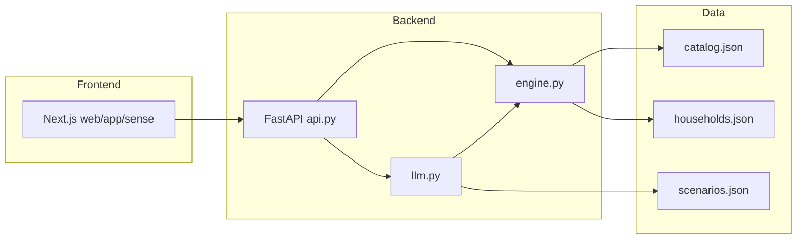

# Blinkit Sense — Project Overview

**Working name:** Blinkit Sense  
**What it is:** A checkout-time prototype that reads what’s in your cart, guesses what life situation you’re shopping for, and suggests complementary items you might have missed — especially from categories you don’t usually buy on Blinkit.

This document is the readable entry point. For the full technical spec, see [architecture.md](./architecture.md). For the product thesis and guardrails, see [problemStatement.md](./problemStatement.md).

---

## What problem this solves

Blinkit is excellent at helping people **re-buy** what they already buy. It is weak at helping people **enter a new category** when a life situation creates a need they’ve never shopped for on the app — moving in, a new pet, festival gifting, someone unwell at home, a movie night, and so on.

Those moments share two traits:

1. **Time pressure** — the customer is mid-task; they buy what they remember and miss the rest.
2. **No purchase history in that category** — collaborative filtering cannot recommend what was never bought.

Blinkit Sense intervenes **at checkout**: it looks at the cart cold (no history), proposes a situation, and after the customer confirms, suggests a small set of items that complete the situation — flagging which suggestions are **new categories** for that household.

---

## What the prototype does (user journey)

The demo runs as a Blinkit-like checkout flow:

1. **Pick a household and location** — Sarjapur or HSR Layout; each household has different order history and known addresses.
2. **Build a cart** — browse categories, search products, or load one of **12 preset scenario carts** (study night, skincare, party snacks, baking, moving in, etc.).
3. **Tap “Get suggestions”** — the system reads the cart and returns up to four **situation candidates** (e.g. “Movie night in”, “Game night in”, “House party”) with confidence scores.
4. **Confirm a situation** — pick a chip, type a custom situation, choose “Just stocking up”, or dismiss.
5. **See suggestions** — up to four add-on products with categories, “New for you” badges, fee breakdown, and options to swap alternatives or dismiss items.
6. **Place order** — selected suggestions merge into the cart for a mock checkout total.

If confidence is too low (e.g. a cart of only milk, bread, and eggs), **nothing is shown** — the system stays silent rather than guessing.

---

## Architecture at a glance

This is **not RAG**. There is no vector database or document retrieval. The flow is:

```
Cart + location  →  LLM (situation)  →  customer confirms  →  LLM (needs)
       →  deterministic catalog match  →  household filter  →  UI
```

| Layer | Role |
|-------|------|
| **Frontend** (`web/`) | Next.js app — cart, situation chips, suggestions panel |
| **API** (`api.py`) | FastAPI — exposes `/situations`, `/needs`, `/catalog`, `/households` |
| **LLM** (`llm.py`) | Two Groq calls — situation reader and need planner |
| **Engine** (`engine.py`) | Resolves abstract needs to real SKUs; filters by location, history, and guardrails |
| **Data** (`data/`) | Catalog, households, scenarios, categories — read at runtime, not live-scraped per click |

A **Streamlit UI** (`app.py`) also exists as an earlier desktop demo of the same backend logic.



---

## Backend

### FastAPI (`api.py`)

| Endpoint | Purpose |
|----------|---------|
| `GET /health` | Health check |
| `GET /households` | Demo household profiles |
| `GET /catalog` | Product catalog (with optional filters) |
| `POST /situations` | **Call 1** — infer situations from cart |
| `POST /needs` | **Call 2** + resolve + filter — return suggestions |

Environment: `GROQ_API_KEY`, `GROQ_MODEL` in `.env`. LLM responses are cached in `data/cache/llm_cache.json`.

### Engine (`engine.py`)

All product grounding is **deterministic Python**:

- **Resolver** — maps each abstract need (e.g. `"bedsheet"`) to one SKU in `catalog.json` at the current location, using keyword overlap and price tie-breaks. Unmatched needs become honest gaps.
- **Household filter** — drops items the household already buys routinely; flags each suggestion as `new_category` or `deepening`; vetoes Health & Pharma and Baby Care from auto-add; caps display at four items with preference for cross-category complements.
- **Fee maths** — Blinkit-style delivery ₹30 + handling ₹12 + small-cart ₹20 below ₹99.

### LLM (`llm.py`) — the two calls

Both use Groq’s OpenAI-compatible API. The model defaults to `openai/gpt-oss-120b` with `llama-3.3-70b-versatile` as fallback when rate-limited.

#### Call 1 — Situation reader

**When:** Customer taps “Get suggestions”.  
**Input:** Cart item names + tile categories, delivery location, unfamiliar-address flag, today’s date.  
**Output:** JSON with `confidence` and exactly four `candidates` (id, label, reasoning, score).

The system prompt instructs the model to:

- Pick only from predefined scenarios in `data/scenarios.json` (~30 life situations).
- Calibrate scores — high for strong situational items (cat food, bedsheet), low for staples-only carts.
- Never use purchase history (it is not provided).
- Return raw JSON only.

#### Call 2 — Need planner

**When:** Customer confirms a situation chip (or custom text).  
**Input:** Situation id, label, prompt context, allowed tile categories, **and the current cart** (categories already covered).  
**Output:** JSON with role-grouped abstract `needs` (e.g. `"popcorn"`, `"bedsheet"`) — never brand names or SKUs.

The system prompt instructs the model to:

- Decompose the situation into searchable product needs using Indian pack wording (“dishwash gel”, not “dishwashing liquid”).
- **Avoid duplicating categories already in the cart** — prefer complements from other allowed categories.
- Spread needs across tiles where possible.
- Omit Health & Pharma and Baby Care from auto-composition.

Each situation also has a **`prompt_context`** string in `scenarios.json` (e.g. moving in → empty home; someone unwell → gentle recovery items only) and an **`IMPLAUSIBLE_TILES`** veto in `engine.py` that restricts which categories the planner may suggest for that situation.

---

## Frontend

### Next.js app (`web/`)

| Path / file | Purpose |
|-------------|---------|
| `app/sense/page.tsx` | Main flow orchestrator — phases: cart → situations → suggestions → order |
| `components/CartPanel.tsx` | Cart lines, fees, checkout |
| `components/SituationPanel.tsx` | Situation chips, custom text, dismiss |
| `components/SuggestionsPanel.tsx` | Suggested items, “New for you”, show other options |
| `components/ScenarioSelector.tsx` | Load one of 12 preset demo carts |
| `components/CategoryBrowseModal.tsx` | Browse catalog by category |
| `lib/constants.ts` | Preset carts, fee constants, confidence threshold |
| `lib/api.ts` | HTTP client to FastAPI backend |

The UI talks to the backend via `NEXT_PUBLIC_API_URL` (default `http://localhost:8000`). Run backend with `uvicorn api:app --reload` and frontend with `npm run dev` in `web/`.

### Streamlit (`app.py`)

Original wide-layout desktop prototype — same pipeline, single Python process. Useful for quick backend testing without the Next.js stack.

---

## Data

| File | Contents |
|------|----------|
| `data/catalog.json` | ~29,600 products — name, category (tile), price, `available_in` locations, images |
| `data/categories.json` | Blinkit’s tile taxonomy (groups + dedicated stores) |
| `data/households.json` | Five demo profiles with order history and known addresses |
| `data/scenarios.json` | ~30 situations with chip labels and planner prompt context |
| `data/locations.json` | Sarjapur, Whitefield, Delhi NCR coordinates and display names |
| `data/cache/llm_cache.json` | Cached LLM responses (keyed by household + cart + situation) |
| `data/raw/<timestamp>/` | Versioned scrape runs with manifests |

**Important rule:** A “category” in this project is a **tile** (e.g. “Pet Store”, “Chips & Namkeen”) — not a top-level group. The `new_category` flag is evaluated at tile level.

---

## Build phases

Development was structured in gated phases under `phases/`:

| Phase | Folder | What it built |
|-------|--------|---------------|
| **1 — Catalogue** | `phase_1_scraper/` | Scrape or import Blinkit products; build `catalog.json`; versioned raw runs. Direct scrape is blocked by Cloudflare; catalogue is hybrid (Apify rows + generated fill + batch category scrapes). |
| **2 — Data layer** | `phase_2_data/` | Load and validate categories, households, locations, scenarios; tile-level history helpers. Gate: `test_categories.py`. |
| **3 — Situation reader** | (integrated in `llm.py`) | Call 1, JSON parsing, confidence gate. Gate: `test_situation.py`. |
| **4 — Confirmation** | (UI) | Situation chips, dismiss, once-per-session behaviour. |
| **5 — Need planner** | (integrated in `llm.py`) | Call 2, cart-aware planning. Gate: `test_needs.py`. |
| **6 — Resolver** | (integrated in `engine.py`) | Need → SKU matching, location filter, honest gaps. |
| **7 — Household filter** | (integrated in `engine.py`) | Owned drop, new_category flags, cap, sensitive veto. Gate: `test_engine.py`. |
| **8+ — UI & deploy** | `web/`, `api.py`, `app.py` | Next.js checkout UI, FastAPI layer, Streamlit demo, preset carts, LLM cache warming. |

Each phase was meant to pass tests before moving on. Root-level `test_*.py` files are the phase gates.

---

## Key design choices (non-technical summary)

| Choice | Why |
|--------|-----|
| **History after confirmation, not before** | Situation detection works for first-time customers; history only personalises suggestions. |
| **Needs, not SKUs, from the LLM** | Prevents hallucinated products — code picks real items from the catalog. |
| **Fail closed** | Bad JSON or low confidence → show nothing, never a broken half-suggestion. |
| **Committed catalogue** | Fast, reliable demos; freshness proven by scrape manifests and git history, not live fetch at click time. |
| **Cross-category suggestions** | Engine prioritises `new_category` items and the planner avoids repeating what’s already in the cart. |
| **12 preset carts** | Curated heterogeneous carts to demo inference quality (skincare + towel, baking + parchment, party + napkins, etc.). |

---

## Running locally

```bash
# Backend
pip install -r requirements.txt
cp .env.example .env   # add GROQ_API_KEY
uvicorn api:app --host 0.0.0.0 --port 8000 --reload

# Frontend
cd web && npm install && npm run dev
# Open http://localhost:3000/sense
```

Optional: warm all preset carts through the pipeline:

```bash
python run_preset_flow.py
```

---

## Related docs

| Document | Best for |
|----------|----------|
| [problemStatement.md](./problemStatement.md) | Product thesis, metric, demo flows, guardrails |
| [architecture.md](./architecture.md) | Full technical architecture, JSON schemas, phase map |
| [phases/phase_1_scraper/README.md](../phases/phase_1_scraper/README.md) | Catalogue build and scrape constraints |
| [phases/phase_2_data/README.md](../phases/phase_2_data/README.md) | Data layer validation |
